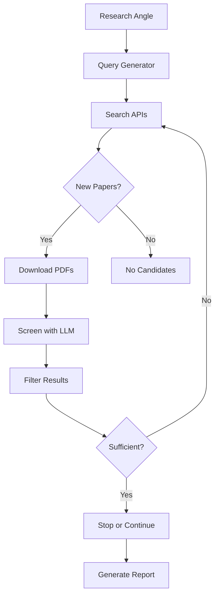

# litscout


**Automated literature search, screening, and prioritization pipeline powered by LLMs.**

## What It Does

`litscout` is an automated literature discovery and screening pipeline for academic researchers. It uses AI to:

1. **Generate smart search queries** based on your research angle
2. **Search academic databases** (Semantic Scholar, OpenAlex, arXiv, PubMed, CORE) for candidate papers
3. **Download PDFs** (with Elsevier ScienceDirect API fallback for paywalled papers)
4. **Screen papers using an LLM** for relevance to your research angle
5. **Keep medium/high relevance papers**, discard the rest
6. **Repeat until sufficient coverage** is achieved
7. **Generate a final Markdown report** summarizing everything found

The tool runs as a CLI application. It loops indefinitely until stopped by the user (Ctrl+C for graceful shutdown) or until configurable thresholds are met.

## How It Works



### Pipeline Flow

1. **Query Generation**: The LLM analyzes your research angle and generates targeted search queries
2. **Academic Search**: Papers are fetched from enabled sources (OpenAlex, Semantic Scholar, arXiv, PubMed, CORE)
3. **Deduplication**: Papers are tracked by DOI to avoid duplicates across iterations
4. **PDF Download**: Open-access PDFs are downloaded; Elsevier API is used as fallback for paywalled papers
5. **LLM Screening**: Each paper is evaluated against your research angle
6. **Relevance Filtering**: High/medium papers are kept; low papers are discarded
7. **Sufficiency Check**: The LLM assesses if enough papers have been collected
8. **Report Generation**: A comprehensive Markdown report is created

## Quick Start

### 1. Clone the Repository

```bash
git clone https://github.com/your-username/litscout.git
cd litscout
```

### 2. Create a Virtual Environment

```bash
python -m venv .venv
source .venv/bin/activate  # Windows: .venv\Scripts\activate
```

### 3. Install Dependencies

```bash
pip install -e .
```

### 4. Configure Environment Variables

Copy `.env.example` to `.env` and fill in your API keys:

```bash
cp .env.example .env
# Edit .env with your API keys
```

See the [API Setup Guide](#api-setup-guide) for details on obtaining each key.

### 5. Configure Search Sources

Copy `input/settings.example.yaml` to `input/settings.yaml` and enable your sources:

```bash
cp input/settings.example.yaml input/settings.yaml
# Edit input/settings.yaml to enable your sources
```

### 6. Write Your Research Angle

Copy `input/research.example.md` to `input/research.md` and write your research focus:

```bash
cp input/research.example.md input/research.md
# Edit input/research.md with your research angle
```

### 7. Run litscout

```bash
litscout
# or
python -m litscout.main
```

### 8. Find Your Results

After the pipeline completes, you'll find:

- **`output/kept_papers/`**: Downloaded PDFs of relevant papers
- **`output/reports/`**: Final Markdown reports
- **`output/manifest.json`**: Running log of all papers processed

## Project Structure

```
litscout/
├── input/                          # ← YOUR INPUT GOES HERE
│   ├── research.md                 #   Your research angle
│   ├── research.example.md         #   Template for research.md
│   ├── settings.yaml               #   Your source & target settings
│   └── settings.example.yaml       #   Template for settings.yaml
├── .env                            # ← YOUR API KEYS GO HERE
├── config.yaml                     # Advanced technical settings (rarely need to edit)
├── prompts/                        # LLM system prompts (don't edit unless you know what you're doing)
├── litscout/                       # Source code
└── output/                         # Results appear here
```

## Three Things to Configure

```
1. API keys      → .env
2. Sources       → input/settings.yaml
3. Research angle → input/research.md
```

## Configuring Search Sources

Edit `input/settings.yaml` to enable the sources you have access to:

| Source | Role | Key Required? | Coverage | Best For |
|--------|------|---------------|----------|----------|
| OpenAlex | Search + PDF | No (email optional) | 250M+ works, all disciplines | General academic research |
| Semantic Scholar | Search + PDF | No (optional for speed) | 200M+ papers, AI-ranked | CS, biomedical, broad coverage |
| Elsevier | PDF only | Yes (institutional) | Paywalled Elsevier journals | University-subscribed content |
| arXiv | Search + PDF | No | 2.4M+ preprints | Physics, math, CS, quantitative biology |
| PubMed | Search + PDF | No (optional for speed) | 36M+ citations | Biomedical and life sciences |
| CORE | Search + PDF | Yes (free) | 300M+ metadata, 40M+ full texts | Open access aggregation |

## Configuration

### User Settings (`input/settings.yaml`)

This is the main configuration file for most users:

| Setting | Description | Default |
|---------|-------------|---------|
| `target_papers` | Stop when this many papers are kept | 20 |
| `max_iterations` | Max search-screen cycles (0 = unlimited) | 0 |
| `auto_stop` | Auto-stop when target is hit | false |
| `sources.*.enabled` | Enable/disable a source | false |
| `sources.*.role` | `search_and_pdf` or `pdf_only` | - |

### Technical Settings (`config.yaml`)

Advanced settings for pipeline internals (rarely need to edit):

| Setting | Description | Default |
|---------|-------------|---------|
| `api.max_tokens` | Maximum tokens for LLM responses | 16384 |
| `api.temperature` | LLM temperature (0.0-1.0) | 0.3 |
| `search.queries_per_iteration` | Queries generated per round | 5 |
| `search.results_per_query` | Max results per query | 20 |
| `search.year_range` | Only papers from last N years | 5 |
| `download.concurrency` | Max simultaneous downloads | 5 |
| `screening.batch_size` | Papers per LLM screening call | 10 |

## API Setup Guide

### LLM (OpenAI-compatible)

Any OpenAI-compatible endpoint works. Default is Alibaba DashScope:

- **DashScope**: Get your API key at [Alibaba Cloud](https://dashscope.console.aliyun.com/)
- **OpenAI**: Get your API key at [OpenAI Platform](https://platform.openai.com/api-keys)
- **Azure OpenAI**: Get your key from Azure Portal
- **Ollama**: Run locally at `http://localhost:11434`

### OpenAlex

Free API, no key required but providing an email is polite:

- **No key required**: Free and open
- **Add email for polite pool**: [OpenAlex Documentation](https://docs.openalex.org/how-to-use-the-api/rate-limits-and-authentication)
- **Format**: `OPENALEX_EMAIL=your_email@example.com`

### Semantic Scholar

Free API with optional key for higher rate limits:

- **Without key**: 10 requests/minute shared across all users
- **With key**: 1 request/second guaranteed
- **Get a key**: [Semantic Scholar API Key Request](https://www.semanticscholar.org/product/api#api-key)

### Elsevier / ScienceDirect

Optional API for paywalled paper access:

- **Get API key**: [Elsevier Developer Portal](https://dev.elsevier.com/)
- **Institutional token**: Email `datasupport@elsevier.com` from your university email
- **On-campus/VPN**: API key alone may be sufficient

### arXiv

Free API, no key needed. Preprints in physics, math, CS, biology, economics, and more.

### PubMed / NCBI

Free API, no key required but optional key for higher rate limits:

- **Without key**: 3 req/sec
- **With key**: 10 req/sec
- **Get key**: [NCBI Account Settings](https://www.ncbi.nlm.nih.gov/account/settings/)

### CORE

Free API key required (register at [CORE](https://core.ac.uk/services/api)):

- World's largest open access aggregator: 300M+ metadata records, 40M+ full texts
- Harvests from 10,000+ institutional repositories worldwide

## Output Format

The final report is a Markdown file with:

1. **Header**: Generation timestamp, iteration count, paper statistics
2. **Research Angle**: Your original research prompt
3. **Summary Table**: All kept papers with relevance and brief descriptions
4. **Detailed Evaluations**: Full analysis for each kept paper
5. **Coverage Analysis**: Gaps identified by the LLM
6. **Search Queries Used**: All queries across all iterations

## CLI Options

| Flag | Description | Overrides |
|------|-------------|-----------|
| `--config PATH` | Path to technical config | `config.yaml` |
| `--target-papers N` | Target number of relevant papers | `input/settings.yaml → target_papers` |
| `--max-iterations N` | Maximum search-screen cycles | `input/settings.yaml → max_iterations` |
| `--continue` | Ignore sufficiency, keep running | — |
| `--stop` | Run one more iteration then stop | — |
| `--help` | Show help message and exit | — |

Examples:

```bash
# Run with default config
litscout

# Use custom config file
litscout --config myconfig.yaml

# Ignore sufficiency and keep running
litscout --continue

# Override target papers
litscout --target-papers 30
```

## Graceful Shutdown

Press `Ctrl+C` to gracefully stop the pipeline. It will:

1. Finish the current iteration
2. Save the manifest
3. Generate a final report
4. Clean up temporary files

## Note on Language Support

Currently supports English-language papers only. Japanese language support is planned for a future release.

## License

MIT License - see [LICENSE](LICENSE) for details.

## Acknowledgments

- **Semantic Scholar** (Allen Institute for AI) - Free academic paper search API
- **OpenAlex** - Open bibliographic database
- **Elsevier** - ScienceDirect API for paywalled paper access
- **arXiv** - Open-access preprint repository
- **PubMed / NCBI** - Biomedical literature database
- **CORE** - Open access aggregator

## Contributing

Contributions are welcome! See [CONTRIBUTING.md](CONTRIBUTING.md) for details.

## Citation

If you use litscout in your research, please cite:

```bibtex
@software{litscout2026,
  title={litscout: Automated Literature Search and Screening Pipeline},
  author={litscout contributors},
  year={2026},
  url={https://github.com/your-username/litscout}
}
```
